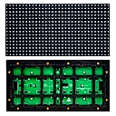

# LED Panel Driver Module



A Minimal MicroPython driver module for Panel P10 32*16 Matrix display and its variants, to handle 1/4 scanline and its unconventional byte data arrangements.

## Usage Example

```python
from framebuf import FrameBuffer, MONO_HLSB
from machine import Pin

from led_panel import LEDPanel

# Init
led = LEDPanel(
  pe = Pin(14, Pin.OUT),
  pa = Pin(13, Pin.OUT),
  pb = Pin(12, Pin.OUT),
  pclk = Pin(18, Pin.OUT),
  plat = Pin(19, Pin.OUT),
  pdr = Pin(23, Pin.OUT),
  freq = 1000,
  duty = 1
)

w = 32
h = 16

# FrameBuffer
ba = bytearray((w * h) // 8) # 1 bpp
fb = FrameBuffer(ba, w, h, MONO_HLSB)

# Main code
def main():
  x = 0
  while 1:
    fb.fill(0)
    fb.text("Hi,all!", x+w, 0, 1)
    fb.text("WOW!", 0, 9, 1)
    
    x = (x-1) % -96
    
    # Mandatory pause
    # Can be used as sleep
    await led.hold(50 / 1000) # msec

# Execute
# Must be last
led.run(ba, main)
```

The `hold()` function is a convenient utility for adding a mandatory asyncio pause without the need to import asyncio into the main code. It allows to add a pause in seconds, including float and fractions, or leave it empty for the shortest possible pause.

## License

This project is provided under the [GPLv3+ License](https://spdx.org/licenses/GPL-3.0-or-later.html). Feel free to use, modify, and distribute it according to the terms of the license.
